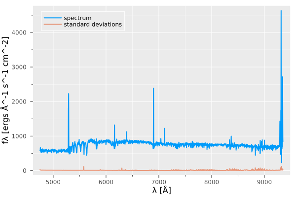
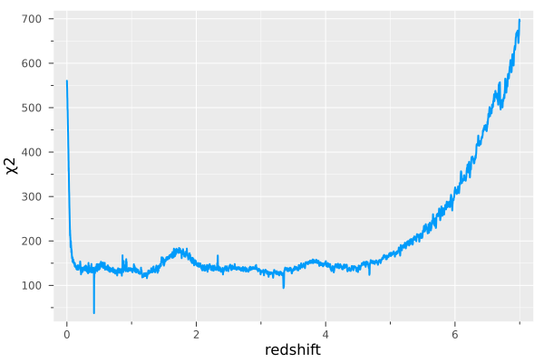

```@meta
EditURL = "../_literate/Example.jl"
```

# Usage Example
Let's start by importing the needed packages

````julia
using Moose, FITSIO, Plots
````

Let's instantiate a rest frame wavelength grid (Γgrid) and the Basis Struct.
```julia
wgrid = Γgrid()
basis = Basis()
```

Let's load a spectrum from a .fits file,

````julia
hdul = FITS("../../../data/spectra_sample/udf10_00002.fits", "r")
fλ   = read(hdul["DATA"])
σλ   = read(hdul["STAT"]) |> (x -> sqrt.(x))
λref = read_header(hdul["DATA"])["CRVAL1"]
L    = read_header(hdul["DATA"])["NAXIS1"]
δλ   = read_header(hdul["DATA"])["CDELT1"]
λ    = collect(Float32, λref .+ (0:L-1) .* δλ)
close(hdul)
````

Take a look at the spectrum!

````julia
p = plot(λ, fλ, lw =2 , xlabel ="λ [Å]", ylabel ="fλ [ergs Å^-1 s^-1 cm^-2]", label ="spectrum",)# size =(500,200))
plot!(p, λ, σλ, lw =2 , alpha = 0.7, label = "standard deviations")
````


Usually raw data comes with many NaNs and Infs, let us clean the flux densities and the standard deviations. We assign zeros for NaNs in fluxes, and a high number for NaNs and Infs in standard deviations,

```julia
replace!(fλ, NaN => 0)
replace!(σλ, NaN => 1f6, Inf => 1f6)
σλ[fλ .== 0] .= 1f6
```

Now, we can interpolate the flux densities and standard deviations to the rest frame grid, for this just run,
```julia
intrpfλ, intrpσλ = interpolate(basis, fλ .* λ, σλ .* λ , λ)
```

Run a threaded NNLS to test all possible redshifts

```julia
χ2 = threaded_nnls(basis, intrpfλ, intrpσλ)
```

Plot the obtained χ2 curve.
```julia
p = plot(wgrid.ζ, χ2, xlabel = "redshift", ylabel= "χ2")
```



---

*This page was generated using [Literate.jl](https://github.com/fredrikekre/Literate.jl).*

