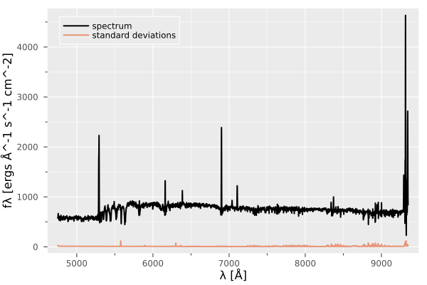
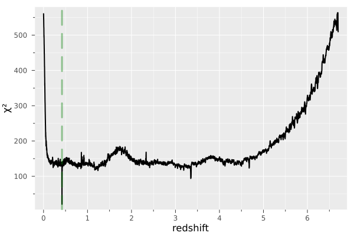

```@meta
EditURL = "../_literate/basic_usage.jl"
```

# Basic usage of `Moose.jl`

This example illustrates the basic usage of `Moose.jl`: loading a galaxy spectrum from a FITS file,
constructing the wavelength–redshift grid and spectral basis explicitly, performing redshift inference, and visualizing the results.

### Imports

We begin by importing `Moose.jl` along with a few auxiliary packages used for
data handling and visualization.

````julia
using Moose, FITSIO, Plots

````

### Wavelength–redshift grid and basis

The first step is to construct a `Γgrid` struct, which defines the rest-frame log-wavelength grid and the grid of
trial redshifts used during inference. Two keyword arguments are particularly important for creating this instance:
- `λmin`: the blue-end of the observed-frame wavelength range (in Å),
- `δζ`: the spacing of the trial redshifts grid.

````julia
wgrid = Γgrid(; λmin = 4700f0, δζ = 5f-4);
````

Next, we create an instance of the `Basis` struct, which provides a low-rank
internal representation of galaxy spectra. This object stores wavelength-sliced
versions of the basis matrix `H`, corresponding to the trial redshifts defined
in the associated `Γgrid` instance. Furthermore, it precomputes and stores the Gram matrix (HᵀH)
for each slice in order to avoid re-computations during redshift inference.

When constructing a `Basis` instance, the user may choose the rank of the
representation (rank ∈ [6, 14]). For optimal redshift inference performance, we recommend setting the rank to 10.

````julia
basis = Basis(wgrid; rank = 10);
````

### Loading and visualizing the spectrum

We load an example spectrum from a FITS file. The file contains the
flux density vector (in the "DATA" HDU) and the corresponding variance (in the "STAT" HDU), from
which we derive the standard deviation vector.

````julia
hdul = FITS("../../../data/spectra_sample/udf10_00002.fits", "r")
f   = read(hdul["DATA"])
σ   = read(hdul["STAT"]) |> (x -> sqrt.(x))
λref = read_header(hdul["DATA"])["CRVAL1"]
N    = read_header(hdul["DATA"])["NAXIS1"]
δλ   = read_header(hdul["DATA"])["CDELT1"]
λ    = collect(Float32, λref .+ (0:N-1) .* δλ)
close(hdul)
````

Take a look at the spectrum and its associated uncertainties.

````julia
p = plot(λ, f, lw =2 , xlabel ="λ [Å]", ylabel ="fλ [ergs Å^-1 s^-1 cm^-2]",color="black", label ="spectrum",)
plot!(p, λ, σ, lw =2 , alpha = 0.7, label = "standard deviations")
````


The plot above displays an emission-line galaxy spectrum at redshift [0.4193](https://amused.univ-lyon1.fr/project/UDF/HUDF/2).
Usually, raw data comes with `NaN` and `Inf` values. To avoid errors related to these values, let us clean the flux densities and standard deviations.
We assign zeros for `NaN`s in fluxes, and a high number for `NaN`s and `Inf`s in standard deviations.

````julia
replace!(f, NaN => 0)
replace!(σ, NaN => 1f6, Inf => 1f6)
σ[f .== 0] .= 1f6
````

````
0-element view(::Vector{Float32}, Int64[]) with eltype Float32
````

### Redshift inference
We interpolate the flux densities and standard deviations to the rest-frame grid using the `interpolate()` function.

````julia
fʳ, σʳ = interpolate(basis, f, σ , λ);
````

!!! note
    The function `interpolate()` interpolates the products f × λ and σ × λ  to the rest-frame log-wavelegths grid

Run a threaded FNNLS to test all possible redshifts using the `flow()` function.
For each trial redshift in `wgrid.ζ`, the `flow()` function projects the spectrum into the basis slice (corresponding to this trial redshift).
The projection is carried out using a fast non-negative least squares follwed by a χ² error evaluation between input and reconstruction. The `flow()`
function outputs a χ² vector represeting error for each trial redshift.

````julia
χ² = flow(basis, fʳ, σʳ);
````

The `flow()` function returns the χ² vector (error for each trial redshift). We can now plot the obtained χ² curve.
```julia
p = plot(wgrid.ζ, χ², xlabel = "redshift", ylabel= "χ²")
```



The χ² curve displays a minimum at the true redshift (vertical green dashed line), Hence successfully predicting the correct redshift.
`Moose.jl` implements a significance and a robustness score to assess the confidence of the redshift prediction, see this [paper]() for further details.
The significance score can be computed by calling the `Δχ²()` function.

````julia
Δχ²(χ²)
````

````
0.8462723091811408
````

similarly, the robustness score is computed by calling the `R()` function.

````julia
R(χ²)
````

````
12.729961f0
````

The values of these scores indicated a significant and robust minimum in the χ² curve.

---

*This page was generated using [Literate.jl](https://github.com/fredrikekre/Literate.jl).*

