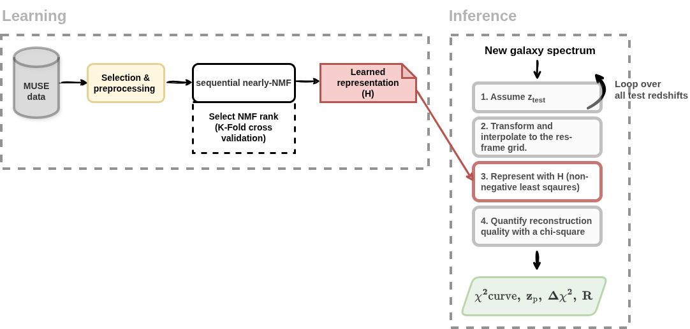

# Moose.jl Documentation

Welcome to the documentation for `Moose.jl`!

## Installation 
`Moose.jl` can be installed by running
```julia REPL
julia> using Pkg
julia> Pkg.add(Pkg.add(url="https://github.com/masten-bourahma/Moose.jl", rev="dev")
```
!!! warning
    This package is still under development.

## Overview
**`Moose.jl`** is a Julia package for accurate and automated galaxy redshift estimation from spectroscopic data.
The package was developed in the context of a PhD thesis focused on building robust redshift prediction and source detection tools for hyperspectral observations acquired with the Multi-Unit Spectroscopic Explorer (MUSE) instrument [1] at the Very Large Telescope (VLT).

`Moose.jl` is designed to operate efficiently on large spectral datasets and to integrate seamlessly with modern Julia-based data analysis workflows.

## Working principles 

Internally, `Moose.jl` relies on a **learned low-rank rest-frame representation** of galaxy spectra observed with MUSE. This representation is learned via **Non-negative Matrix Factorization (NMF)** applied to a training set of approximately 7,000 galaxy spectra with known redshifts. The learned representation consists of **10 non-negative basis vectors in the rest frame**, capturing the stellar continuum, emission and absorption spectral features of the galaxy population.

For redshift inference on new (test) spectra, `Moose.jl` **projects each spectrum onto the learned basis across a grid of trial redshifts**. The redshift grid spans a user-defined range (typically 0 ≤ z ≤ 6.7) with a spacing chosen by the user. At each trial redshift, `Moose.jl` performs a non-negative least-squares reconstruction and evaluates the corresponding **χ² metric** between the observed and reconstructed spectra.

This procedure produces a χ² curve (error as a function of redshift), from which the global minimum is selected as the predicted redshift. Futhermore, `Moose.jl` computes a significance and robustness scores in order to quantify the confidence of the prediction.

For a detailed methodological description and validation, we refer the reader to the accompanying paper [to be linked]. A chart that summarizes `Moose.jl`'s workflow is shown below



## Main features
This package provides the following features:

* An implementation of the nearly-NMF algorithm [2]
* An implementation of the Fast Non-Negative Least Squares (FNNLS) [3]
* An implementation of a multi-threaded FNNLS
* Code for redshift predictions on fits files / datacubes
* Code for spectral debelending (under construction) 

## Acknowledgement
The development of this package was supervised by **Nicolas BOUCHE**, **Roland BACON** 

## References
[1]: Bacon Roland et al., *The MUSE second-generation VLT instrument*, 2010. https://arxiv.org/pdf/2211.16795

[2]: Dylan Green and Stephen Bailey, *Algorithms for Non-Negative Matrix Factorization on Noisy Data With Negative Values*, 2024. https://arxiv.org/abs/2311.04855

[3]: https://three-mode.leidenuniv.nl/pdf/b/brodejong1997jc.pdf